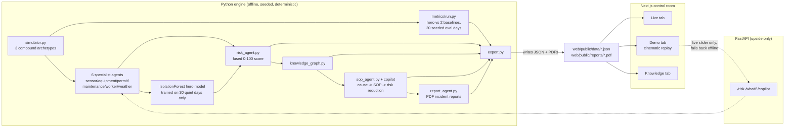
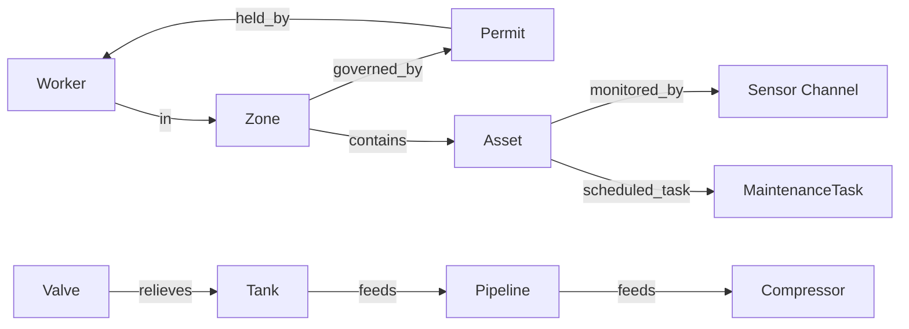

# PlantPulse — Architecture

## Data flow

- **Python is the brains.** `engine/` runs offline, seeded, deterministic. It
  owns the simulator, the fusion model, the knowledge graph, the SOP/copilot
  logic, the PDF report generator, and all metrics. Nothing in it depends on
  the network or on the web app being up.
- **Next.js is the face.** `web/` renders whatever JSON `engine/export.py`
  wrote to `web/public/data/`. The Live, Demo, and Knowledge tabs never make
  a network call — the cinematic demo plays back precomputed JSON and
  cannot break on stage because it never depends on a live process.
- **FastAPI is upside, not a dependency.** `engine/api.py` (S6) powers only
  the live what-if slider on the Demo tab. If it's down, `WhatIf.tsx` falls
  back to a precomputed grid built with the exact same scoring function
  (`engine/engine/whatif.py`), so the fallback can never silently drift from
  what the live endpoint would have returned.

## Knowledge graph schema

Built fresh from the `Plant` object every run (`engine/engine/knowledge_graph.py`)
— never a hand-authored static graph. For each of the 3 archetypes,
`compute_hazardous_path` walks the nodes that event's own `asset_ids`,
`zone_id`, and (where present) `worker_intrusion` data actually touch, and
assembles a one-sentence explanation entirely from real fields on the
event, the timeline, and the graph — e.g. checking whether the worker
entering a zone is actually covered by that zone's standing permit
(`covering_permit.worker_id != intrusion["worker_id"]`), not a templated
guess.

## Determinism

Every simulation run uses a fixed seed (`engine/simulator.py::SEED = 42`
for the demo scenario; disjoint seed ranges for calibration [1000-1029],
evaluation [2000-2019], and false-alarm measurement [3000-3019]). Same
seed in → byte-identical output out, every time — verified directly via
SHA-256 comparison across repeated `export.py` and `metrics/run.py` runs.
This is what lets the demo be scripted and rehearsed instead of hoped for.

## Honesty guardrails

- No metric is ever hand-edited. `engine/metrics/run.py` is the only place
  performance numbers come from — if a number was weak during development,
  the scenario or fusion logic got redesigned and re-run, not the number
  (see `DEFENSE.md` for the specific instances this actually happened).
- Any business/₹ figure is labeled "Simulation output" in the UI and traces
  to `data/cost_basis.md`: cited, disclosed assumptions × real simulated
  counts. No "lives saved" figure is shown — a life-safety claim tied to a
  simulation would be dishonest regardless of labeling.
- The three compound-incident archetypes (`engine/simulator.py`) are
  constructed so every affected raw sensor channel stays under its own
  single-channel alarm threshold for the full incident window — enforced by
  `_validate_single_channel_normalcy`, which raises if an archetype
  accidentally becomes a normal single-sensor alarm rather than a compound
  one.
- The hero model trains exclusively on 30 seeded quiet days, never on the
  3 archetypes — an unsupervised design specifically so the reported
  metrics measure genuine anomaly detection, not memorization of our own
  fixtures.

## Module map

| Path | Owns |
|---|---|
| `engine/data_model.py` | Assets, Workers, Zones, Permits, Maintenance, Weather |
| `engine/simulator.py` | Seeded time-series + 3 compound archetypes |
| `engine/export.py` | Writes every `web/public/data/*.json` + PDF reports |
| `engine/preview.py` | Sanity-check plots in `engine/_preview/` |
| `engine/api.py` | FastAPI service for the live what-if slider |
| `engine/agents/{sensor,equipment,permit,maintenance,worker,weather}_agent.py` | Six independently-explainable specialist agents |
| `engine/agents/risk_agent.py` | Fuses agents + hero model into 0-100 score, contributors, confidence |
| `engine/agents/sop_agent.py` | Archetype → SOP procedure + model-simulated risk reduction |
| `engine/agents/report_agent.py` | PDF incident report generation (reportlab) |
| `engine/engine/calibration.py` | 30-day normal-operation statistics (channels + per-agent) |
| `engine/engine/features.py` + `model.py` | Feature engineering + IsolationForest hero model |
| `engine/engine/baselines.py` | Threshold baseline (A) + rolling z-score baseline (B) |
| `engine/engine/metrics.py` | Pure lead-time/false-alarm/detection calculation functions |
| `engine/engine/knowledge_graph.py` | Plant graph + per-incident hazardous path + sentence |
| `engine/engine/impact.py` | Impact-board arithmetic (measured count × disclosed assumption) |
| `engine/engine/whatif.py` | Shared counterfactual logic (live API + offline fallback) |
| `engine/metrics/run.py` | Hero vs. both baselines, 20 seeded eval days → `results.json` |
| `engine/copilot/` | `llm.py` (documents why no live LLM call), `templates.py`, `cache.json` |
| `web/app/` | Live / Demo / Metrics / Knowledge tabs |
| `web/components/` | Twin, Heatmap, Gauge, ContributorBars, KnowledgeGraph, Copilot, Timeline, WhatIf, ImpactBoard |
| `data/sop_library.json` | Cited SOP procedures (OISD-STD-105, Factories Act 1948) |
| `data/cost_basis.md` | Every impact-board assumption, disclosed and cited |
